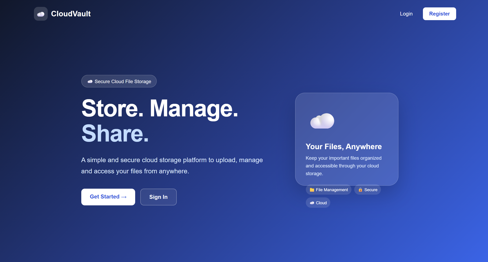
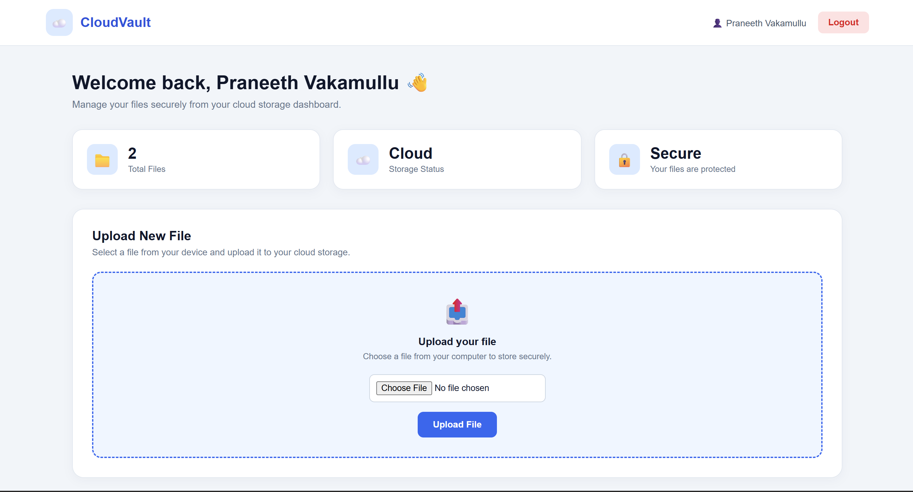
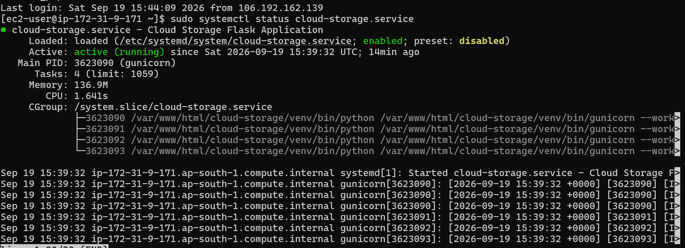
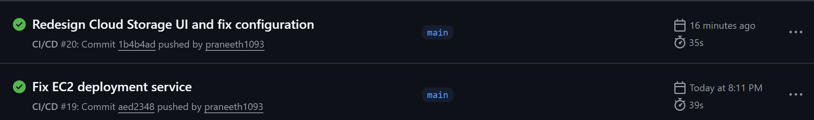

# ☁️ Cloud File Storage Web Application

A full-stack cloud-based file storage web application built using **Python Flask, MySQL, and AWS services**. The application allows users to register, log in, upload files, view their stored files, download files, and delete files.

The application is deployed on **AWS EC2**, uses **Amazon S3 for file storage**, **Amazon RDS MySQL for database management**, and **GitHub Actions for CI/CD automation**.

---

## 🚀 Project Overview

The main goal of this project is to build a simple and scalable cloud storage system where:

* **Amazon S3** stores the actual uploaded files.
* **Amazon RDS MySQL** stores user information and file metadata.
* **Flask** handles the application logic and API requests.
* **Nginx** acts as a reverse proxy.
* **Gunicorn** runs the Flask application.
* **Systemd** manages the application service.
* **GitHub Actions** automates testing and deployment.

This project helped me understand how a web application can integrate with cloud storage, databases, Linux servers, and CI/CD infrastructure.

---

## 🛠️ Technologies Used

### Application

* **Python**
* **Flask**
* **Flask-MySQLdb**
* **Werkzeug**
* **Boto3**
* **HTML5**
* **CSS3**

### AWS

* **Amazon EC2** – Application hosting
* **Amazon S3** – Cloud file storage
* **Amazon RDS MySQL** – Relational database

### DevOps

* **Git**
* **GitHub**
* **GitHub Actions**
* **Nginx**
* **Gunicorn**
* **Systemd**

---

## ✨ Features

* 👤 User Registration
* 🔐 User Login & Logout
* 🔑 Password Hashing
* 📤 File Upload
* ☁️ Amazon S3 Cloud Storage
* 📋 View Uploaded Files
* 📥 Download Files
* 🗑️ Delete Files
* 👥 User-specific file ownership checks
* 🗄️ MySQL database integration
* 🌐 Nginx reverse proxy
* 🚀 Gunicorn application server
* ⚙️ Systemd service management
* 🔄 GitHub Actions CI/CD
* 📱 Responsive user interface

---

# 🏗️ System Architecture

```text
                         ┌─────────────────────┐
                         │        User         │
                         │     Web Browser     │
                         └──────────┬──────────┘
                                    │
                                    ▼
                         ┌─────────────────────┐
                         │       Nginx         │
                         │   Reverse Proxy     │
                         └──────────┬──────────┘
                                    │
                                    ▼
                         ┌─────────────────────┐
                         │      Gunicorn       │
                         │   Flask Application  │
                         └──────────┬──────────┘
                                    │
                       ┌────────────┴────────────┐
                       │                         │
                       ▼                         ▼
             ┌──────────────────┐      ┌──────────────────┐
             │   Amazon RDS      │      │    Amazon S3     │
             │      MySQL       │      │  Cloud Storage   │
             │                  │      │                  │
             │ • Users          │      │ • Actual Files   │
             │ • File Metadata  │      │                  │
             └──────────────────┘      └──────────────────┘

                         AWS EC2
                            │
                            ▼
                     GitHub Actions
                            │
                            ▼
                    Automated Deployment
```

---

# 🔄 How the Application Works

## 1. User Registration

The user provides their name, email, and password.

The password is securely hashed using **Werkzeug** before being stored in the MySQL database.

---

## 2. User Login

The application verifies the user's email and password.

After successful authentication, a session is created for the user and they are redirected to the dashboard.

---

## 3. File Upload

When a user uploads a file:

```text
User
  ↓
Flask Application
  ↓
Amazon S3
  ↓
Actual File Stored
  ↓
Amazon RDS MySQL
  ↓
File Metadata Stored
```

The actual file is stored in **Amazon S3**, while information such as filename, file type, file size, S3 key, and upload time is stored in MySQL.

---

## 4. File Download

When a user downloads a file:

```text
User
  ↓
Flask Application
  ↓
MySQL
  ↓
Find File Metadata
  ↓
Amazon S3
  ↓
Retrieve File
  ↓
User
```

---

## 5. File Delete

When a user deletes a file:

```text
User
  ↓
Flask Application
  ↓
Amazon S3
  ↓
Delete Actual File
  ↓
MySQL
  ↓
Delete File Metadata
```

Both the S3 object and its corresponding database record are removed.

---

# ☁️ AWS Infrastructure

### Amazon EC2

The Flask application is deployed on an **Amazon EC2 Linux server**.

The EC2 instance runs:

* Flask
* Gunicorn
* Nginx
* Systemd

### Amazon S3

Amazon S3 is used for storing the actual uploaded files.

### Amazon RDS

Amazon RDS for MySQL stores:

* User information
* File metadata
* File ownership
* Upload information

---

# 🔄 CI/CD Pipeline

GitHub Actions is used to automate the deployment process.

```text
Developer
    │
    ▼
Git Push
    │
    ▼
GitHub Repository
    │
    ▼
GitHub Actions
    │
    ├── Checkout Code
    │
    ├── Setup Python
    │
    ├── Install Dependencies
    │
    ├── Run Application Test
    │
    └── Deploy to EC2
             │
             ▼
       Restart Systemd
             │
             ▼
        Gunicorn
             │
             ▼
          Nginx
             │
             ▼
       Live Application
```

---

# 📸 Application Screenshots

## 1. Application Home Page

The redesigned CloudVault interface provides a modern and responsive landing page.



---

## 2. File Upload

Users can select and upload files through the dashboard.



---

## 3. File Management

Uploaded files are displayed in the dashboard with options to download or delete them.


---

## 4. AWS EC2 Deployment

The application runs as a managed Systemd service on the AWS EC2 instance.



---

## 5. GitHub Actions CI/CD

GitHub Actions automatically tests and deploys changes to the AWS EC2 server.



---

# 📁 Project Structure

```text
cloud-storage/
│
├── .github/
│   └── workflows/
│       └── deploy.yml
│
├── static/
│
├── templates/
│   ├── home.html
│   ├── login.html
│   ├── register.html
│   └── dashboard.html
│
├── screenshots/
│   ├── 01-application-running.png
│   ├── 02-file-upload.png
│   ├── 03-file-management.png
│   ├── 04-aws-ec2-deployment.png
│   └── 05-github-actions-cicd.png
│
├── app.py
├── config.py
├── requirements.txt
├── .gitignore
├── README.md
└── sample.txt
```

---

# 🗄️ Database

MySQL is used to store application data and file metadata.

The database contains information such as:

* User ID
* User name
* Email
* Password hash
* File name
* Original file name
* File size
* File type
* S3 key
* User who uploaded the file
* Upload time

---

# ☁️ Why Amazon S3?

Amazon S3 is used to store uploaded files instead of storing them directly on the application server.

This separates application data from file storage:

```text
Amazon RDS
    ↓
Information ABOUT the files

Amazon S3
    ↓
ACTUAL uploaded files
```

This architecture makes the application easier to manage and allows file storage to be handled separately from the application server.

---

# 🔐 Security

The project includes several basic security practices:

* Password hashing using Werkzeug
* Session-based authentication
* User ownership checks
* Database credentials stored using environment variables
* Flask secret key stored using environment variables
* AWS configuration stored using environment variables
* `.env` excluded from Git using `.gitignore`

> Sensitive credentials such as AWS keys, database passwords, and secret keys are not stored in the GitHub repository.

---

# ⚙️ Local Installation

## 1. Clone the Repository

```bash
git clone https://github.com/praneeth1093/cloud-storage.git
cd cloud-storage
```

## 2. Create a Virtual Environment

```bash
python -m venv venv
```

### Windows

```powershell
venv\Scripts\activate
```

### Linux/macOS

```bash
source venv/bin/activate
```

## 3. Install Dependencies

```bash
pip install -r requirements.txt
```

## 4. Configure Environment Variables

Create a `.env` file:

```text
MYSQL_HOST=your_database_host
MYSQL_USER=your_database_user
MYSQL_PASSWORD=your_database_password
MYSQL_DB=your_database_name

SECRET_KEY=your_secret_key

AWS_REGION=your_aws_region
AWS_BUCKET_NAME=your_s3_bucket
```

Do not commit the `.env` file to GitHub.

## 5. Run the Application

```bash
python app.py
```

The application will run at:

```text
http://127.0.0.1:5000
```

---

# 🎯 Challenges Faced

During development, I worked on:

1. Integrating Flask with Amazon S3 using Boto3.
2. Handling file uploads and downloads between Flask and S3.
3. Managing file metadata separately from actual files.
4. Connecting Flask with MySQL/RDS.
5. Implementing user authentication and password hashing.
6. Implementing user-specific file ownership checks.
7. Deploying the Flask application on AWS EC2.
8. Configuring Nginx as a reverse proxy.
9. Running Flask using Gunicorn.
10. Managing the application using Systemd.
11. Automating deployment using GitHub Actions.
12. Managing application configuration using environment variables.

---

# 📚 What I Learned

Through this project, I gained practical experience in:

* Python Flask development
* AWS EC2 deployment
* Amazon S3
* Amazon RDS MySQL
* Boto3
* MySQL database integration
* User authentication
* File upload/download handling
* Linux server management
* Nginx reverse proxy configuration
* Gunicorn
* Systemd
* Git and GitHub
* GitHub Actions CI/CD
* Environment variable management
* Cloud application architecture

---

# 🔮 Future Improvements

Possible future improvements include:

* File size and file type validation
* Improved error handling
* AWS IAM-based access control
* S3 encryption configuration
* Presigned URLs for downloads
* File search and filtering
* Folder support
* Storage usage tracking
* Dockerizing the application
* HTTPS/SSL configuration
* Automated testing
* Monitoring with CloudWatch
* Prometheus and Grafana monitoring

---

# 👨‍💻 Author

**Praneeth Vakamullu**

Cloud / DevOps / System Administration Enthusiast

GitHub:
https://github.com/praneeth1093

---

⭐ If you found this project useful, consider giving it a star!
